# Assignment 7

# 👷🏻‍♀️1. aux commands
```bash
ps aux
```
## Explanation:
a → show processes for all users

u → show user/owner of process

x → show processes not attached to a terminal

## Example Output:
```bash
USER       PID  %CPU %MEM    VSZ   RSS TTY      STAT START   TIME COMMANDroot         
1  0.0  0.1 167500  1100 ?        Ss   Sep25   0:05 /sbin/initvibhu     
1234  1.2  1.5 274532 15632 ?        Sl   10:15   0:12 /usr/bin/python3 script.pymysql     
2001  0.5  2.0 450000 20988 ?        Ssl  Sep25   1:02 /usr/sbin/mysqld
```
# 📷Image Snapshots:
```ps aux:```

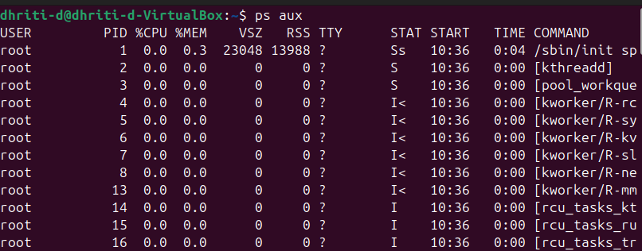

```ps a```, ```ps u```, ```ps x```:

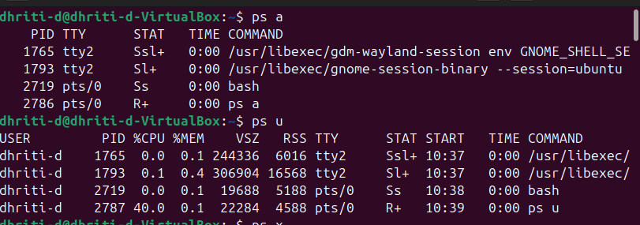
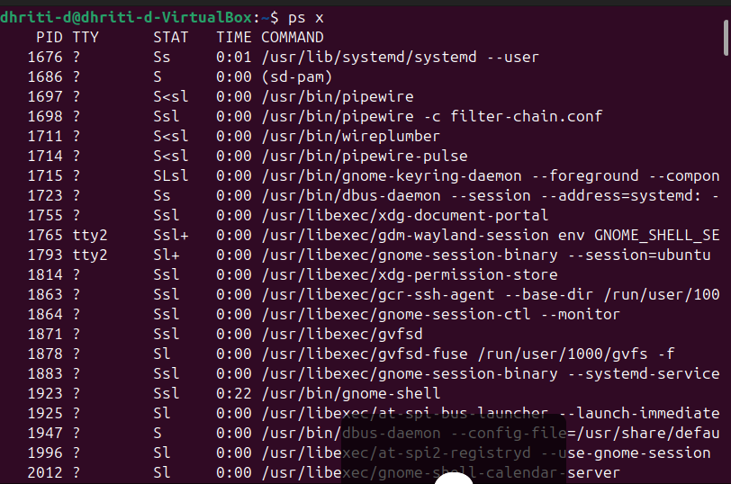

# 🌳 2. Process Tree
## Command:
```bash
pstree -p
```
### Example Output:
```bash
systemd(1)─┬─NetworkManager(778)
           ├─sshd(895)─┬─sshd(1023)───bash(1024)───pstree(1101)
           ├─mysqld(2001)
           └─python3(1234)
```

**👉 Shows parent-child process relationships.**
# 📷Image Snapshots:
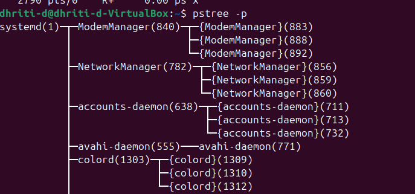

# 👩🏼‍💻3. Real-Time Monitoring
## Command:
```bash
top
```
### Example Output (partial):
```bash
top - 10:20:51 up 2 days,  3:12,  2 users,  load average: 0.22, 0.33, 0.45
Tasks: 197 total,   1 running, 196 sleeping,   0 stopped,   0 zombie
%Cpu(s): 12.3 us,  5.4 sy,  0.0 ni, 80.1 id,  2.2 wa,  0.0 hi,  0.0 si,  0.0 st
KiB Mem :  8045632 total,  3564980 free,  1876324 used,  2604328 buff/cache
PID   USER      PR  NI    VIRT    RES    SHR S  %CPU %MEM     TIME+ COMMAND
1234  vibhu     20   0  274532  15632   7892 R   45.0  1.5   0:12.34 python3
2001  mysql     20   0  450000  20988   7564 S   25.0  2.0   1:02.11 mysqld
```
**👉 Press q to quit.**
# 📷Image Snapshot:
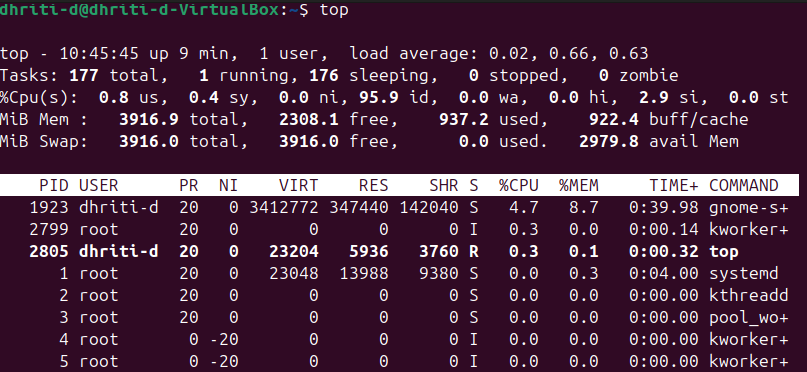

# 🧐 4. Adjust Process Priority
## Start a process with low priority:
```bash
nice -n 10 sleep 300 &
```
### Output:
```bash
[1] 3050
```

**👉 PID = 3050 is running in background with nice value 10.**
# 📷Image Snapshot:
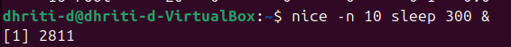
## Change priority of running process:
```bash
renice -n -5 -p 3050
```
### Output:
```bash
3050 (process ID) old priority 10, new priority -5
```

**👉 Now process runs with higher priority.**
## If it shows 'PERMISSION DENIED' then run the command as:
```bash 
sudo renice -n -5 -p 3050
```

**👉It will ask for your password.**
### Output:
```bash 
3050 (process ID) old priority 10, new priority -5
```
# 📷Image Snapshot:
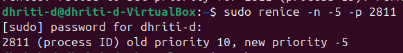

# 🖥️ 5. CPU Affinity (Bind Process to CPU Core)
## Command:
```bash
taskset -cp 3050
```
### Example Output:
```bash
pid 3050's current affinity list: 0-3
```

**👉 Shows process is allowed on cores 0,1,2,3.**
# 📷Image Snapshot:
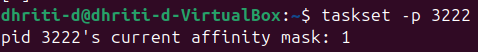
## Restrict to core 1 only:
```bash 
taskset -cp 1 3050
```
### Output:
```bash 
pid 3050's current affinity list: 1
```
# 📷Image Snapshot:

### 🔸Since my CPU has only 1 core, i.e. 0, the command given above will fail. Hence the reason why I am restricting it to core 0 only.
### 🔸You can check how many cpu cores you have by using the ```lscpu``` command.

# 📂 6. I/O Scheduling Priority
## Command:
```bash 
ionice -c 3 -p 3050
```
### Output:
```bash 
successfully set pid 3050's IO scheduling class to idle
```
# 📷Image Snapshot:
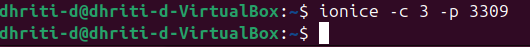

**🔹(No output= Succeeded silently)**

**👉 Class 3 (idle) → Process only gets I/O when system is idle.**

# 📜 7. File Descriptors Used by a Process
## Command:
```bash 
lsof -p 3050 | head -5
```
### Example Output:
```bash
COMMAND  PID USER   FD   TYPE DEVICE SIZE/OFF   NODE NAMEsleep   3050 vibhu  cwd  DIR  253,0     
4096  131073 /home/vibhusleep   3050 vibhu  rtd  
DIR  253,0     4096       2 /
sleep   3050 vibhu  txt  REG  253,0    17520  133580 /usr/bin/sleep
```
# 📷Image Snapshot:
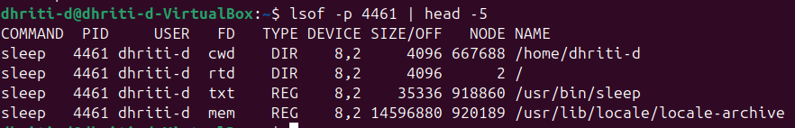

# 📞 8. Trace System Calls of a Process
## Command:
```bash
strace -p 3050
```
### Example Output:
```bash
strace: Process 3050 attachedrestart_syscall(<... resuming interrupted nanosleep ...>) = 
0nanosleep({tv_sec=300, tv_nsec=0}, 0x7ffd4a60d8b0) = ? ERESTART_RESTARTBLOCK (Interrupted by signal)
```

**👉 Great for debugging system calls and process behaviour.**

# 📷Image Snapshot:
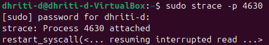

# 📡 9. Find Process Using a Port
## Command:
```bash 
sudo fuser -n tcp 8080
```
### Output:
```bash 
8080/tcp:           4321
```

**👉 PID 4321 is using port 8080.**

**👉If it shows no output then it means that the specified port is not in use.**

# 📷Image Snapshot:


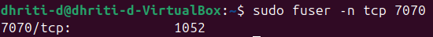

# 📊 10. Per-Process Statistics
## Command:
```bash 
pidstat -p 3050 2 3
```
### Example Output:
```bash
Linux 5.15.0 (ubuntu)   09/25/25        _x86_64_        (4 CPU)
12:30:20      UID       PID    %usr %system  %CPU   CPU  Command12:30:22     
1000      3050    0.00    0.00   0.00     1  sleep12:30:24     1000      
3050    0.00    0.00   0.00     1  sleep12:30:26     1000      3050    
0.00    0.00   0.00     1  sleep
```
**👉 Shows CPU usage every 2 seconds, 3 times.**
### 📷Image Snapshot:
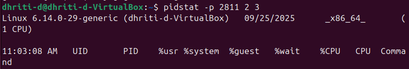

# 🔐 11. Control Groups (cgroups) for Resource Limits
## Create a new cgroup:
```bash
sudo cgcreate -g cpu,memory:/testgroup
```
### 🔸This will create a new cgroup named ```/testgroup``` under both the ```cpu``` and ```memory``` subsystems.
### 🔸To execute the above, you need to download `cgroup tools`.

## Limit CPU and Memory:
```bash
echo 50000 | sudo tee /sys/fs/cgroup/cpu/testgroup/cpu.cfs_quota_usecho 100M  | sudo tee /sys/fs/cgroup/memory/testgroup/memory.limit_in_bytes
```
### Here the processes in `testgroup` can use at most 50% of one CPU core.

## Add a process (PID 3050) to cgroup:
```bash
echo 3050 | sudo tee /sys/fs/cgroup/cpu/testgroup/cgroup.procs
 ```

### 🔸Here the `cgroup` is limited to 100 MB of RAM. 
### 🔸Basically the processes in `cgroup` cannot use more than 100 MB of memory.

# 🤭12. Alternatives to `nice/renice`

## 1. chrt (Real-Time Schedulig)
### 🔸Set real-time scheduling policies (FIFO or Round Robbin).

### The commands:
```bash
sudo chrt -f 50 sleep 1000
```
### 🔸It will give no output. It runs `sleep` for 1000 seconds.
### 🔸Your terminal will wait for `sleep` to finish.

```bash
chrt -p <pid>
```
### 🔸This command displays the current scheduling policy and priority of a running process.

### 📸Image Snapshot:
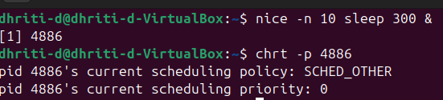

### 📸Image Snapshot:
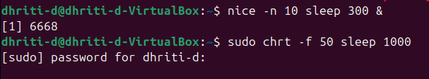

## 2. ionice (I/O Priority Control)
### The command:
```bash
ionice -c 2 -n 7 tar -czf backup.tar.gz /home
```
### 🔸It runs the `tar` command (which mankes a compressed backup of `/home`), but with low disk I/O priority.

### 📸Image Snapshot:
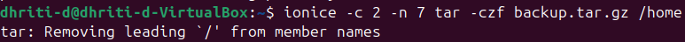
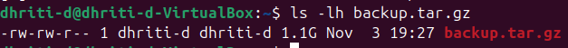

## 3. taskset (CPU Affinity)
### The command:
```bash
taskset -c 1 firefox
```
### 🔸Firefox will only execute on CPU core 1, never switching to other cores.
### 🔸If the command was successfull it will not give any output.
### 🔸If it shows any informational warning about not loading the atk-bridge module because its functionality is already provided by GTK.

### 📸Image Snapshot:
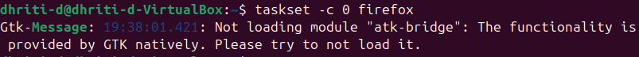

## 4. Control Groups (cgroups)
### The command:
```bash
sudo cgcreate -g cpu,memory:/lowprio
echo 20000 | sudo tee /sys/fs/cgroup/cpu/lowprio/cpu.cfs_quota_us
echo 200M | sudo tee /sys/fs/cgroup/memory/lowprio/memory.limit_in_bytes
echo 1234 | sudo tee /sys/fs/cgroup/cpu/lowprio/cgroup.procs
```
### 🔸This creates a control group (cgroup) called `lowprio` and applies CPU and memory limits to it.
### ⚠️This is safe only if the pid being used is a test or non-critical process.
### ⚠️If it is a PID given by the system, it may slow down or even crash under resource pressure.
### 🟡Better to **avoid running it.**

## 5. systemd-run
### The command:
```bash
systemd-run --scope -p CPUweight=200 stress --cpu 4
```
### 🔸Runs a command under a transient systemd scope with specific resource weights.
### ⚠️The `stress` tool will consume CPU resources while running. It is safe for testing but will slow other tasks temporarily.
### 🟡Better to **avoid running it.**

## 6. schedtool
### The command:
```bash
sudo schedtool -R -p 10 <pid>
```
### 🔸Changes the CPU scheduling policy and priority of a running process.
### ⚠️Real time scheduling can be dangerous if applied to the wrong process. It can monopolize CPU time and make your system unresponsive.
### ⚠️Always keep a terminal open to revert it or reboot if the system locks up.
### 🟡Better to **avoid running it.**

## Summary Table
| Tool | Focus | Alternative to |
| :--: | :---: | :----: |
| chrt | Real time scheduling policies| nice |
| ionice | I/O priority control | (complementary) |
| taskset | CPU affinity control | (complementary) |
| cgroups | File-grained resource management | nice (more powerful) |
| systemd-run | systemd+cgroups resource management | nice |
| schedtool | Custom scheduling policies | nice |