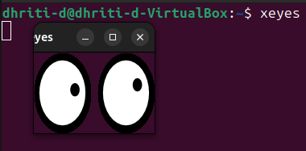

# Assignment 8
### Objective: Set up and verify secure GUI access from your laptop to a friend's laptop on the same or different network using SSH (X11 or VNC). Assume you have explicit permission.

## ⭕1. Prepare and Secure the Remote Machine (run on friend's laptop)

### 1. SSH should be downloaded. 
### 🔸If not then use the command: 
```bash
sudo apt update
sudo apt install -y openssh-server
```
### 📸Image Snapshots:


### 2. Check your as well as your friend's ip address beforehand using:
```bash
ip a
```
### 🔸If it shows:
```bash
inet 172.20.10.5/28 brd 172.20.10.15 scope global dynamic enp0s3
``` 
### Then the ip address is **172.20.10.5**.
### 📸Image Snapshot:

### Here the ip is: **127.0.0.1**.
### 3. Create a non-root user and enable SSH:
```bash
sudo useradd -m frienduser || true
sudo systemctl enable --now ssh
```
### 📸Image Snapshot:


### 4. Add your public key to `/home/frienduser/.ssh/authorized_keys` and set correct permissions:
```bash
mkdir -p /home/frienduser/.ssh/ && echo "<your-pubkey>" >>
sudo chmod 700 /home/frienduser/.ssh
sudo chmod 600 /home/frienduser/.ssh/authorized-keys
sudo chown -R frienduser:frienduser /home/frienduser/.ssh
```
### OR
```bash
sudo mkdir -p /home/frienduser/.ssh/
echo "<your-pubkey>" | sudo tee -a /home/frienduser/.ssh/authorized-keys
sudo chmod 700 /home/frienduser/.ssh
sudo chmod 600 /home/frienduser/.ssh/authorized-keys
sudo chown -R frienduser:frienduser /home/frienduser/.ssh
```
### 📸Image Snapshot:


## ⭕2. Connect & Test X11 Forwarding (single GUI app)
### 🔸From your laptop, test key-based SSH + X11:
```bash
ssh -p 22 -x frienduser@FRIEND_IP
```
### 🔸It will ask for the friend's password.
### 📸Image Snapshot:


### 🔸After entering the password, run the command:
```bash
xeyes
```
### OR
```bash
gedit &
```
### 🔸If its successful the GUI app opens on your machine and is responsive.

### 📸Image Snapshot:


## ⭕3. Set Up VNC over SSH (full desktop)
### i) Update and then download the VNC server on your friends laptop:
```bash
sudo apt update
sudo apt install tigervnc-standalone-server
```

### 📸Image Snapshot:


### ii) On your friend's laptop start the VNC server:
```bash
vncser :1
```
### It will ask to set atleast a 6 characters password and verify it.
### 📸Image Snapshot:


### iii) On your laptop create tunnel:
```bash
ssh -L 5901:localhost:5901 -p 22 frienduser@FRIEND_IP -N &
```
### **Here 5901 is a port.**

### 🔸It'll ask for the friend's password.
### 📸Image Snapshot:


### iv) After entering the password, open VNC viewer to `localhost:5901`.
### v) If it's successful full remote desktop will be visible and clipboard/keyboard will be usable.