# Assignment 1
## Unit 1: Linux Basics
### **```pwd```**: Diplays the full and absolute path of the current working directory.

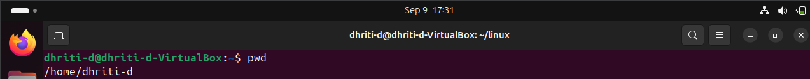

### **```ls```**: Allows to view all the files and folders in current working directory.


### **```ls -a```**: Lists down all file and folder including the one which are hidden.


### **```ls -la```**: Lists all files, including hidden ones, with detailed information.

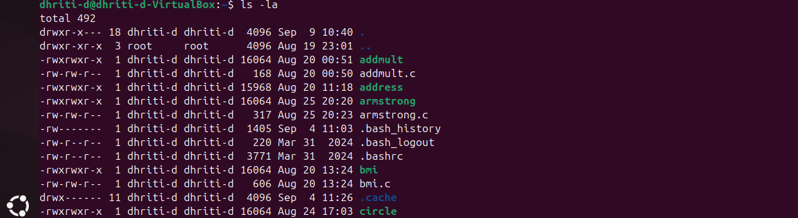

### **```ls -l linux1.txt```**: Used to list information about files and directories within the file system.

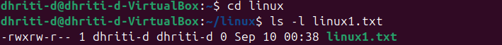

### **```cd scripts```** or **```cd linux```**: Moves into a directory named as scripts/linux.

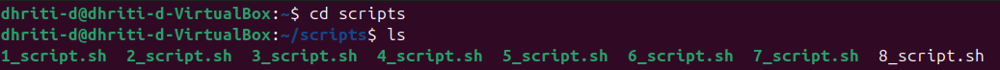
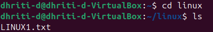

### **```cd ..```**: Moves the directory back one directory.

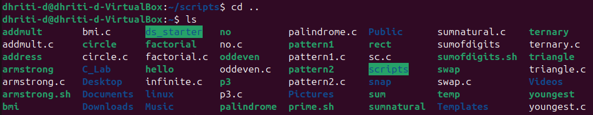

### **```mkdir linux```**: Creates a new folder named as linux.

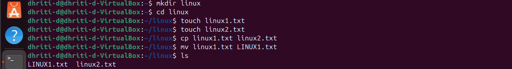

(The directory was changed to linux which proves that linux folder was created.)

### **```touch linux1.txt```** or **```touch linux2.txt```**: Creates a new and empty text file with the specified name.

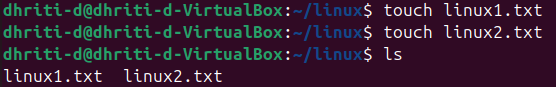

### **```mv linux1.txt LINUX1.txt```**: Renames the file linux1.txt to LINUX1.txt.

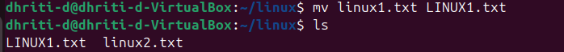

### **```rm linux2.txt```**: It permanently removes the specified file.

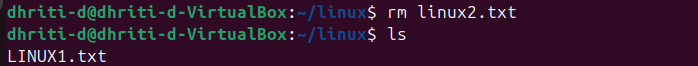

### **```nano LINUX1.txt```**: It is a basic termibal based text editor. It opens the specified file and the terminal clears up and Nano editor interface will appear. You will be able to code in the editor.

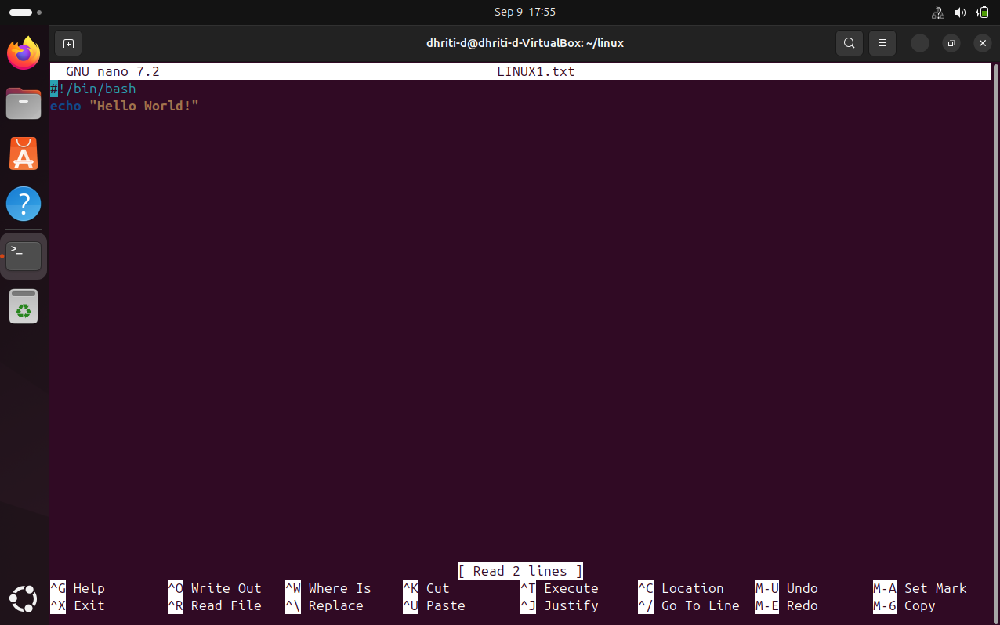

### **```cat LINUX1.txt```**: Displays the file content in the terminal.

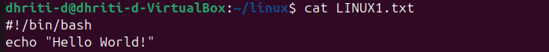

### **```echo "HELLO WORLD!"```**: This command will print the string "HELLO WORLD!" in the terminal.

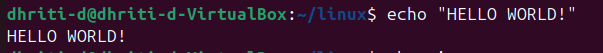

### **```whoami```**: Used to display the username of the current effective user. This refers to the user account under which the shell or script is currently operating.


### **```man ls```**: It will open the manual page for ls, providing detailed information about its usage, available options and examples.


### **```grep "Hello" LINUX1.txt```**: It searches for the exact string "Hello" in the file named LINUX1.txt.

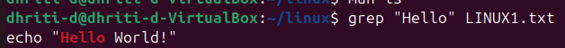

### **```chmod u+x linux1.txt```**: It adds execute for owner.

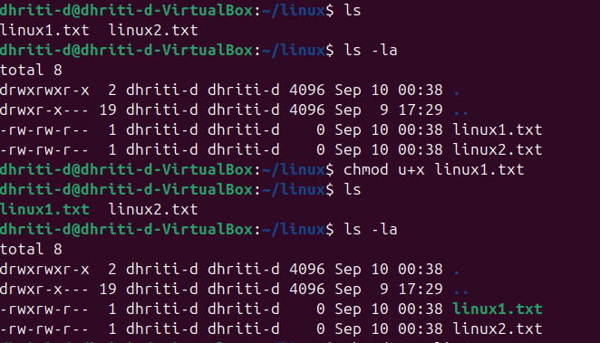

### **```chmod 777 linux2.txt```**: Any user can read, modify and execute linux2.txt.

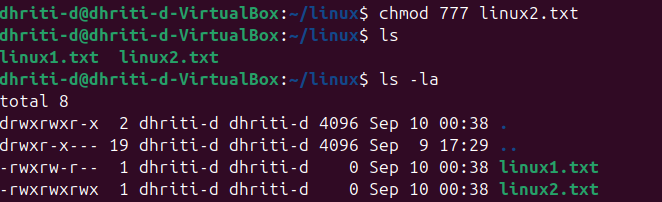

### **```sudo chown dhr:grp class.txt```**: It is used to change the ownership of a file named as class.txt.

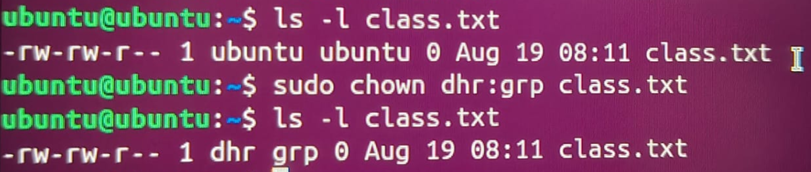

### **```sudo chgrp developers linux1.txt```**: Used to change the group ownership of a file named linux1.txt to a group named "developers".

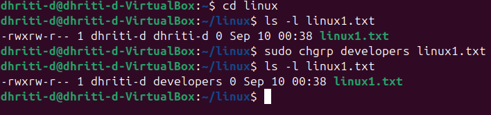

### **Extra Questions**

Q1. What is the difference between chmod and chown?

Ans. ```chmod:``` 

-This command modifies the permissions of a file or directory. 

-Permissions define what actions such as read, write or execute can be performed by different entities (owner, group, others).

```chown:``` 

-This command modifies the ownership of a file or directory. 

-It changes which user and/or group is associated with the file or directory.

Q2. How do you check current directory and user?

Ans. To check the current directory, we use the command ```pwd```. It displays the full and absolute path of the current working directory.

To check the current user, we use the command ```whoami```. It displays the username of the current effective user.


