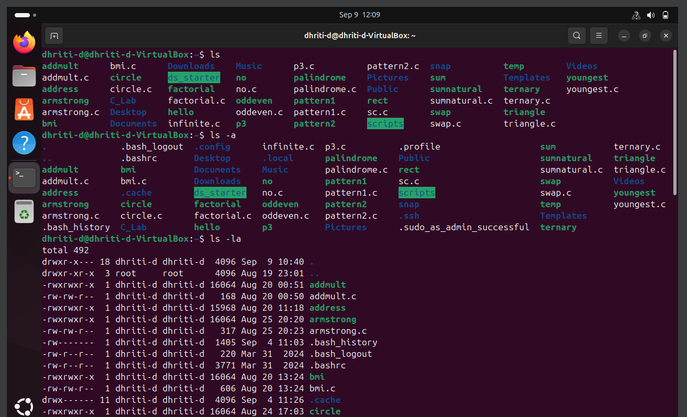
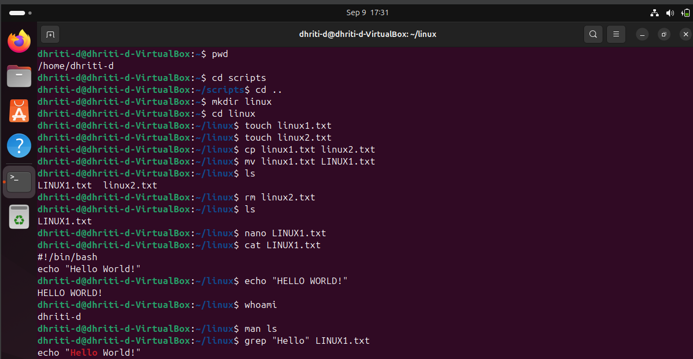

# Assignment 1
## Unit 1: Linux Basics

pwd: Diplays the full and absolute path of the current working directory.

ls command: Allows to view all the files and folders in current working directory.

ls -a: Lists down all file and folder including the one which are hidden.

ls -la: Lists all files, including hidden ones, with detailed information.

cd scripts or cd linux: Moves into a directory named as scripts/linux.

cd ..: Moves the directory back one directory.

mkdir linux: Creates a new folder named as linux.

touch linux1.txt or touch linux2.txt: Creates a new and empty text file with the specified name.

mv linux1.txt LINUX1.txt: Renames the file linux1.txt to LINUX1.txt.

rm linux2.txt: It permanently removes the specified file.

nano LINUX1.txt: It is a basic termibal based text editor. It open the specified file and the terminal
clears up and Nano editor interface will appear. You will be able to code in the editor.

cat LINUX1.txt: Displays the file content in the terminal. 

echo "HELLO WORLD!": This command will print the string "HELLO WORLD!" in the terminal.

whoami: Used to display the username of the current effective user. This refers to the user account
under which the shell or sript is currently operating.

man ls: It will open the manual page for ls, providing detailed information about its usage,
available options and examples.

grep "Hello" LINUX1.txt: It searches for the exact string "Hello" in the file named LINUX1.txt.

