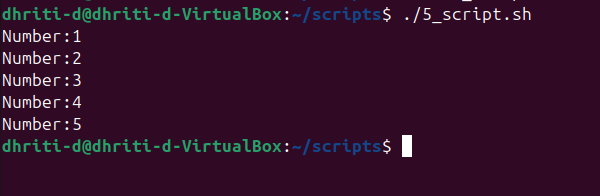

# Assignment 3: Modify an Existing Script
## Objective: Enhance and Modify a Script
### **📜Script chosen:** 5_script.sh
### The program:


### **```OUTPUT:```**



### 🔸Before modifying the program, user input was invalid. Range was already specified.
### 🔸After modifying the program the user can input start, end and step values.
### 🔸The older script ```5_script.sh``` has been saved as ```enhanced_numbers.sh```.
### The program is as follows:


### **```OUTPUT:```**


### 🔸Difference in the behaviour of the original (5_scripts.sh) and the enhanced (enhanced_scripts.sh) scripts is as follows:

| 5_script.sh | enhanced_numbers.sh |
| :-------: | :-------: |
| 🔹This script prints numbers in a basic loop ranging from 1-5. | 🔹This script asks the user for input (start, end, step) and includes validation.|
| 🔹User interaction is rare. | 🔹User interaction is included. |
| 🔹It doesn't ask for input from the user. | 🔹It asks for input (start, end and step) from the user. |
| 🔹Range is already specified. | 🔹Range is specified by the user. |

### **Extra Questions**

Q1. Difference between $1, $@, and $# in bash?

Ans. ```$1:``` -It is a positional parameter. 

-Represents the first positional argument passed to the script or function.

```$@:``` -Expands to all positional parameters where each paramenter is treated as a seperate individually quoted string.

-It is crucial especially when arguments contain spaces or special characters.

```$#:``` -Expands to the total number of positional parameters/arguments passed to the script or function.

-It displays number of arguments provided.

Q2. What does exit 1 mean in a script?

Ans. ```exit 1``` means that a problem or an error has occured during the script's execution.