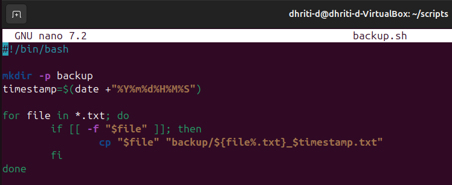
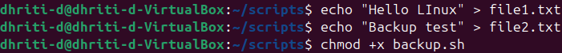
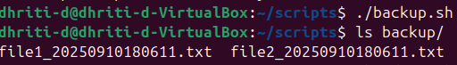

# Assignment 4: File and Backup Automation
## Objective: Automate file management.

### First I created a ```backup.sh``` script then wrote the code in it.


### 📷Image Snapshot of the Code:


### 💭How the script works?
🔸The script ```backup.sh``` creates a folder named as 'backup' if it doesn't already exists.

🔸It generate a timestamp in the format: ```YYYYMMDDHHMMSS```.

🔸It then loops through all '.txt' files in the current directory.

🔸Each '.txt' file is copied into the backup folder with the timestamp appended to the filename, just before the '.txt' extension.

### Example Run:
🔸I created two text files by executing the given commands in the terminal:
```bash
echo "Hello LInux" > file1.txt
echo "Backup Test" > file2.txt
```
#### 📷Image Snapshot:


🔸Command to run the script backup.sh: ```./backup.sh```

🔸Command to verify the backup files in the backup directory: ```ls backup/```

### OUTPUT:


### Extra Questions
#### Q1. What is the difference between cp, mv, and rsync?

Ans. ```cp (copy):```

-It duplicates files and directories. 

-It creates a new copy of the source files or directories at a specified destination, leaving the original untouched.

```mv (move or rename):```

-It moves or renames files or directories.

-Relocates the source file or directory to a new location, deleting the original one from the previous location.

```rsync (remote synchronize):```

-Synchronizes files and directories, often between local and remote locations, but also effectively locally.

-Its key advantage is efficient incremental transfers.

#### Q2. How can you schedule scripts to run automatically?

Ans. You can schedule scripts to run automatically by using ```cron```. It is a time based job scheduler.

It allows you to schedule tasks to run automatically at specified intervals or time.