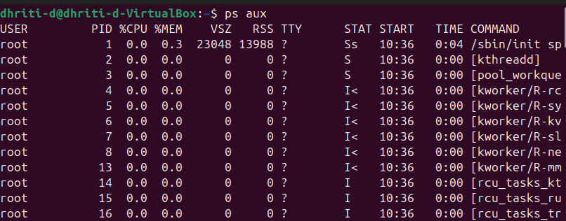
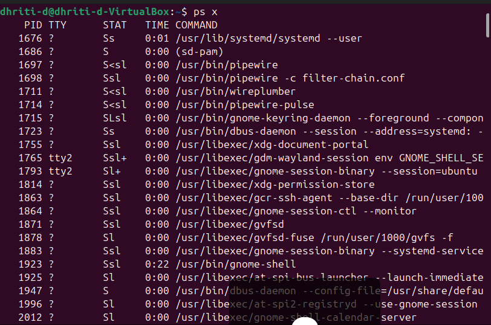
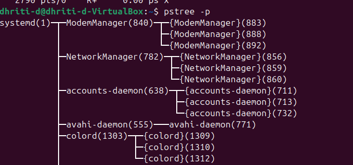
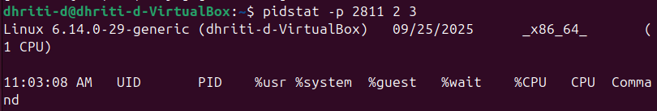

# LAB 6

# 👷🏻‍♀️1. aux commands
```bash
ps aux
```
## Explanation:
a → show processes for all users

u → show user/owner of process

x → show processes not attached to a terminal

## Example Output:
```bash
USER       PID  %CPU %MEM    VSZ   RSS TTY      STAT START   TIME COMMANDroot         1  0.0  0.1 167500  1100 ?        Ss   Sep25   0:05 /sbin/initvibhu     1234  1.2  1.5 274532 15632 ?        Sl   10:15   0:12 /usr/bin/python3 script.pymysql     2001  0.5  2.0 450000 20988 ?        Ssl  Sep25   1:02 /usr/sbin/mysqld
```
# 📷Image Snapshots:
```ps aux:```



```ps a```, ```ps u```, ```ps x```:




# 🌳 2. Process Tree
## Command:
```pstree -p```
### Example Output:
```bash
systemd(1)─┬─NetworkManager(778)
           ├─sshd(895)─┬─sshd(1023)───bash(1024)───pstree(1101)
           ├─mysqld(2001)
           └─python3(1234)
```

**👉 Shows parent-child process relationships.**
# 📷Image Snapshots:


# 👩🏼‍💻3. Real-Time Monitoring
## Command:
```top```
### Example Output (partial):
```bash
top - 10:20:51 up 2 days,  3:12,  2 users,  load average: 0.22, 0.33, 0.45
Tasks: 197 total,   1 running, 196 sleeping,   0 stopped,   0 zombie
%Cpu(s): 12.3 us,  5.4 sy,  0.0 ni, 80.1 id,  2.2 wa,  0.0 hi,  0.0 si,  0.0 st
KiB Mem :  8045632 total,  3564980 free,  1876324 used,  2604328 buff/cache
PID   USER      PR  NI    VIRT    RES    SHR S  %CPU %MEM     TIME+ COMMAND
1234  vibhu     20   0  274532  15632   7892 R   45.0  1.5   0:12.34 python3
2001  mysql     20   0  450000  20988   7564 S   25.0  2.0   1:02.11 mysqld
```
**👉 Press q to quit.**
# 📷Image Snapshot:


# 🧐 4. Adjust Process Priority
## Start a process with low priority:
```nice -n 10 sleep 300 &```
### Output:
```[1] 3050```

**👉 PID = 3050 is running in background with nice value 10.**
# 📷Image Snapshot:

## Change priority of running process:
```renice -n -5 -p 3050```
### Output:
```3050 (process ID) old priority 10, new priority -5```

**👉 Now process runs with higher priority.**
## If it shows 'PERMISSION DENIED' then run the command as:
```sudo renice -n -5 -p 3050```

**👉It will ask for your password.**
### Output:
```3050 (process ID) old priority 10, new priority -5```
# 📷Image Snapshot:


# 🖥️ 5. CPU Affinity (Bind Process to CPU Core)
## Command:
```taskset -cp 3050```
### Example Output:
```pid 3050's current affinity list: 0-3```

**👉 Shows process is allowed on cores 0,1,2,3.**
# 📷Image Snapshot:

## Restrict to core 1 only:
```taskset -cp 1 3050```
### Output:
```pid 3050's current affinity list: 1```

# 📂 6. I/O Scheduling Priority
## Command:
```ionice -c 3 -p 3050```
### Output:
```successfully set pid 3050's IO scheduling class to idle```
# 📷Image Snapshot:


**🔹(No output= Succeeded silently)**

**👉 Class 3 (idle) → Process only gets I/O when system is idle.**

# 📜 7. File Descriptors Used by a Process
## Command:
```lsof -p 3050 | head -5```
### Example Output:
```bash
COMMAND  PID USER   FD   TYPE DEVICE SIZE/OFF   NODE NAMEsleep   3050 vibhu  cwd  DIR  253,0     4096  131073 /home/vibhusleep   3050 vibhu  rtd  DIR  253,0     4096       2 /
sleep   3050 vibhu  txt  REG  253,0    17520  133580 /usr/bin/sleep
```
# 📷Image Snapshot:


# 📞 8. Trace System Calls of a Process
## Command:
```strace -p 3050```
### Example Output:
```bash
strace: Process 3050 attachedrestart_syscall(<... resuming interrupted nanosleep ...>) = 0nanosleep({tv_sec=300, tv_nsec=0}, 0x7ffd4a60d8b0) = ? ERESTART_RESTARTBLOCK (Interrupted by signal)
```

**👉 Great for debugging.**

# 📷Image Snapshot:


# 📡 9. Find Process Using a Port
## Command:
```sudo fuser -n tcp 8080```
### Output:
```8080/tcp:           4321```

**👉 PID 4321 is using port 8080.**

**👉If it shows no output then it means that the specified port is not in use.**

# 📷Image Snapshot:


# 📊 10. Per-Process Statistics
## Command:
```pidstat -p 3050 2 3```
### Example Output:
```bash
Linux 5.15.0 (ubuntu)   09/25/25        _x86_64_        (4 CPU)
12:30:20      UID       PID    %usr %system  %CPU   CPU  Command12:30:22     1000      3050    0.00    0.00   0.00     1  sleep12:30:24     1000      3050    0.00    0.00   0.00     1  sleep12:30:26     1000      3050    0.00    0.00   0.00     1  sleep
```
**👉 Shows CPU usage every 2 seconds, 3 times.**
### 📷Image Snapshot:


# 🔐 11. Control Groups (cgroups) for Resource Limits
## Create a new cgroup:
```sudo cgcreate -g cpu,memory:/testgroup```
## Limit CPU and Memory:
```bash
echo 50000 | sudo tee /sys/fs/cgroup/cpu/testgroup/cpu.cfs_quota_usecho 100M   | sudo tee /sys/fs/cgroup/memory/testgroup/memory.limit_in_bytes
```
## Add a process (PID 3050) to cgroup:
````
echo 3050 | sudo tee /sys/fs/cgroup/cpu/testgroup/cgroup.procs
 ```