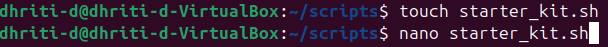
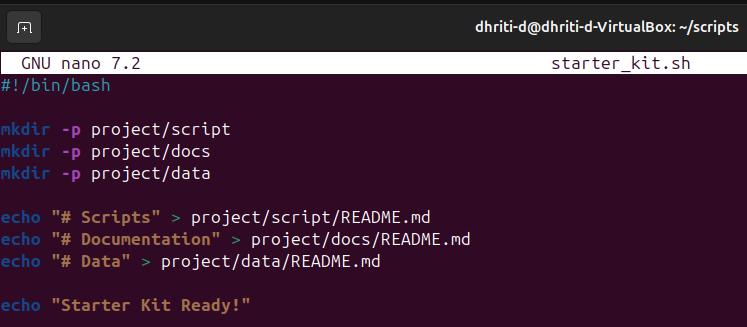
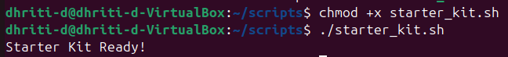

# Assignment: Starter Kit and Automation
## Objective: Build a starter project environment automatically.
### First I created a script ```starter_kit.sh``` then wrote the code in it.


### 📷Image Snapshot of the Code:



### 🧐```PURPOSE:``` 
#### 🔸The script ```starter_kit.sh``` sets up a basic folder structure of a new project, which includes:-

🔹```'script/':``` For code or automation scripts.

🔹```'docs/':``` For documentation.

🔹```'data/':``` For data storage.
#### 🔸Each folder contains a ```README.md``` file as a placeholder to help developers understand the purpose of the folder.
#### 🔸This setup is useful for initialising organised project directories quickly. 

### 📷```Example Run Screenshot:```


### Extra Questions
#### Q1. What does mkdir -p do?

Ans. ```mkdir -p:``` Creates a new, empty directory or parent directory, whose name is defined by path, if the directory already doesn't exists.

If the directory already exists it doesn't show any error.

#### Q2. Why is automation useful in DevOps?

Ans. Automation is useful in DevOps because of:

🔸```Speed and Efficiency:``` It significantly increases speed and efficiency, delivering software faster with less manual effort.

🔸```Reduced Errors:``` Automated processes execute consistently, minimizing human error and inconsistencies that often arise.

🔸```Focus on Innovation:``` Automating routine and labour intensive tasks allows development teams to spend more time on strategic work, coding and innovative feature development.

🔸```Lower Risks:``` Early detection of bugs and issues through automated testing lowers the risk of problems and errors during deployment.