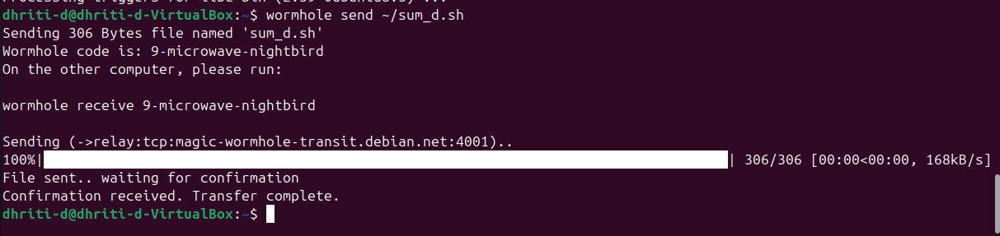

# Transferring a File ```sum_d.sh``` between Two Linux Users while being on Different Network using Secure Shell
### To transfer files between two linux users while being on different networks, I have used **Magic Wormhole**.

### ***🧐Why Magic Wormhole?***
### 🔸Maigc wormhole is an opwn source command line tool that lets two computers securely exchange files or directories using a short, human readable code even when the computers are on different networks.

### 🔸Main goal is to transfer the files securely while still providing strong, end-to-end crytpographic protection.

### ***👮🏻‍♀️Security and Protection***
| **Layer** | **Protection Provided** |
| :---: | :-----------------: |
| Code-based Pairing | Prevents accidental cross connections. |
| End-to-End Encrypted | Protects data confidentiality and integrity. |
| Relay Privacy | Prevents relay operators from reading data. |
| No Persistence | Reduces attack surface and privacy risk. |

### ***🤭Advantages***
### 1. It works even behind NAT/firewalls- no port forwarding.
### 2. No need to create users or share SSH keys.
### 3. It ensures ene-to-end encryption.
### 4. Uses simple short codes instead of long URLs.
### 5. Works on Linux, macOS, Windows.


# **💭How To Transfer Files using Magic Wornhole?**

### 1. Install Magic Wormhole
### On the sender's as well as the reiciever's system download using:
```bash
sudo apt install magic-wormhole
```
### 2. Change the directory to the folder in which the file is located.
### Change directory using: 
```bash
cd <foldername>
```
### 3. Send the file using wormhole
```bash
wormhole send sum_d.sh
```
### It will show a code like: ``` 9-night-bird ```
### 4. Enter the code in the reciever's system using command:
```bash
wormhole receive 9-night-bird
```
### 5. After entering the code, file transfer begins.
### 6. After the transfer is complete, the reciever can check whether the file has been successfully transferred or not using:
```bash
ls
```
### 7. To make it executable use:
```bash
chmod 777 sum_d.sh
```
OR
```bash
chmod +x sum_d.sh
```
### 8. After making it executable, run the file using: 
```bash
./sum_d.sh
```

## 📸Image Snapshot of the Sender's as well as the Reciever's Screen
### 🖼️**Senders image:**



### 🖼️**Recievers Image:**
