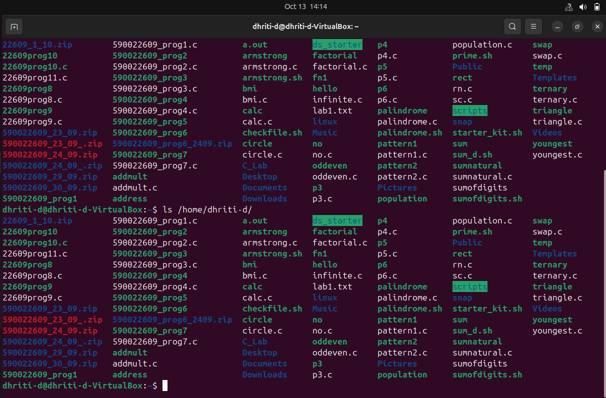

# Transferring a File ```sum_d.sh``` between Two linux users while being on Same Network using Secure Shell
### While being on the same network a user can send files to another user through linux terminal using ```scp``` command.

## 🧐What is ```scp``` command?
### 🔸```scp``` stands for Secure Copy Protocol or Secure Copy Program.

### 🔸It is a command line tool used to copy files and directories between systems securely over a network, using SSH (Secure Shell) for authentication and data transfer.

### ***💭How it Works?***
### 1. Run the ```scp``` command using:
```bash
scp /path/to/file username@remote_ip:/path/to/destination
```
OR
```bash
scp myfile.fileextension user@ip:/home/user/
```

**Here 'ip' is the ip address of the user. Command for checking the ip address: ```ip a```** 

### 2. ```scp``` connects via SSH to the remote host using a port (default port is 22).

### 3. It will ask the sender as well as the reciever to enter password.

### 4. After entering the password data transfer begins. All the data such as file contents, filenames, etc. are encrypted.

### 5. When the transfer is complete the reciever can check whether he/she has recieved it or not using the ```ls``` command.

### ***👮🏻‍♀️Security and Protectin***

### 1. Encryption
### All files and commands are encrypted in transit. It prevents data interception.

### 2. Authentication
### 🔸Supports passwords, SSH keys or two-factor authentication.
### 🔸Ensures only authorised users can connect.

### 3. Data Integrity
### 🔸SSH's chekcsum mechanism verifies that files are not altered during transfer.

### 4. Confidentiality
### 🔸Every file name and metadata are encrypted.

### ***🤭Advantages***

### 1. It uses SSH for encryption, preventing eavesdropping or data theft.
### 2. It Supports password-based and key-based authentication.
### 3. It is available on Linux, macOS, and Windows.
### 4. Ideal for quick, direct transfers between two machines.
### If SSH access works, scp will work automatically.


# 🤔How to use `scp` for transferring file(s)?

### 1. SSH should be downloaded. 
### If not then use the command: 
```bash
sudo apt install openssh-server
```

### 2. Start the SSH server using: 
```bash
sudo systemctl start ssh
sudo systemctl enable ssh
```
### 3. Check your ip address beforehand using:
```bash
ip a
```
### If it shows:
```bash
inet 172.20.10.5/28 brd 172.20.10.15 scope global dynamic enp0s3
``` 
### Then the ip address is **172.20.10.5**.

### 4. Check the Connection
### From the receiver's system check if you can connect to the sender's system using:
```bash
ssh username@<receiver_ip>
```
### Eg of receiver_ip: 172.20.10.15
### Then it will ask you to enter receiver's password. After entering the correct password, you are now logged into the receiver's system.

### 5. Send Files using `scp`.
### Send the file using the command:
```bash
scp sum_d.sh receiver_username@receiver_ip:/path/to/remote/directory/
```
### When asked for password, enter receiver's password.

### 6. Check if the file was succesfully transferred.

### In the linux terminal the receiver should enter the command:
```bash
ls
```

## 📸Image Snapshot of the Sender's as well as the Reciever's Screen
## 🖼️Sender's Screen:


## 🖼️Reciever's Screen:

### As you can see in the reciever's screen, a script file sum_d.sh has been transferred successfully.
### The reciever checked if he/she recieved the file by using ```ls``` command.