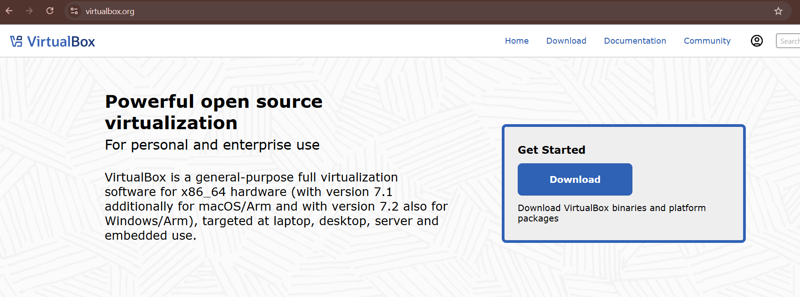
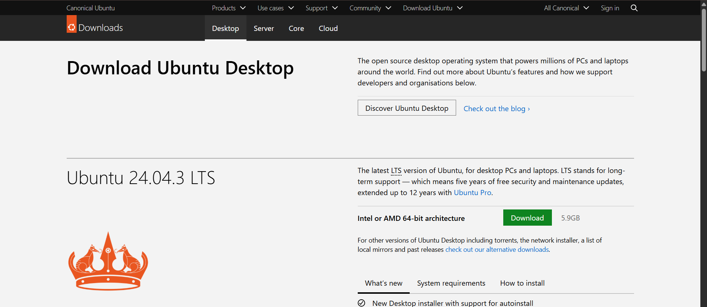
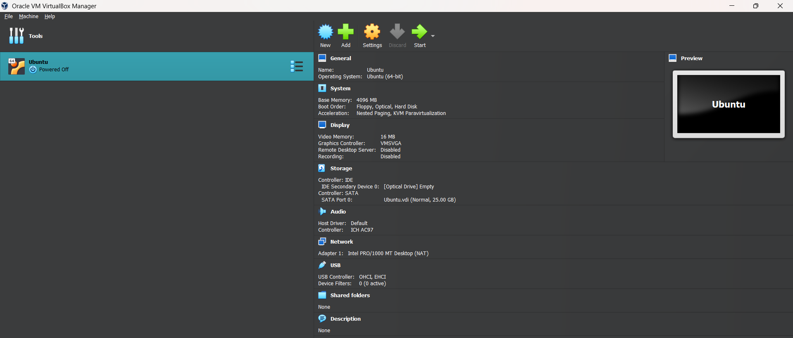
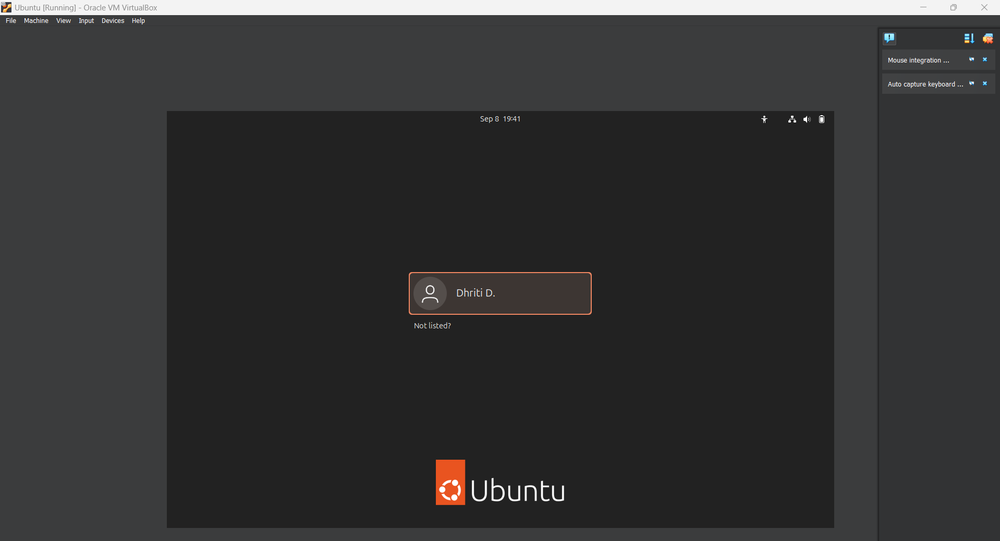
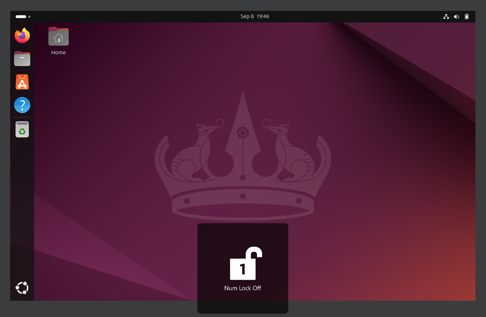
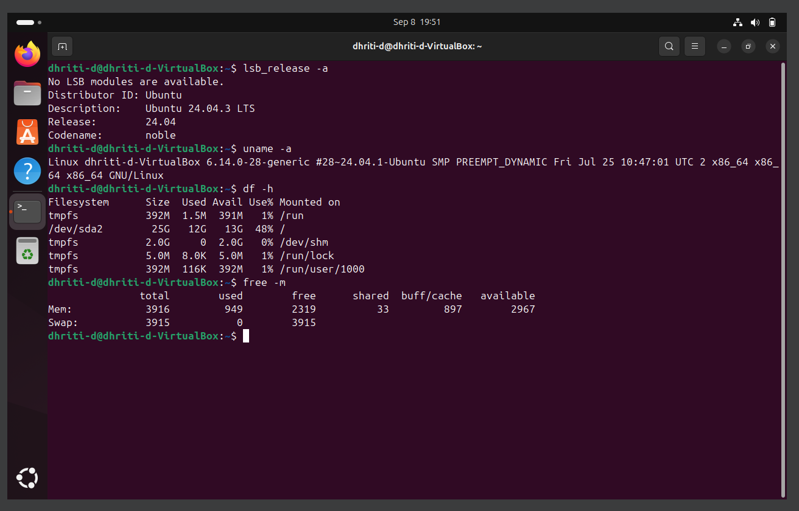

# Assignment 0
**Objective: Set up a working Linux environment for lab work.**

Task 1: To download Ubuntu using Virtual Box/Dual Boot(Advanced)

1. The installation method chosen is Virtual Box(VM).

2. I downloaded Ubuntu from its official site.

3. After setting up the VM I was able to access Ubuntu from Oracle VM Virtualbox.

4. I clicked the "Start" button to use Ubuntu and the login page popped up.

5. After entering/setting up the password the homepage of Ubuntu appeared.

Task 2: To run the following commands in Ubuntu and save outputs:

i) lsb_release -a (shows Ubuntu version).

ii) uname -a (kernel info).

iii) df -h (disk usage).

iv) free -m (memory usage).

I clicked on the terminal to run the given commands and the outputs are as follows:

**Q. What challenges did you face during installation?**

Ans.
1. Due to network issues it took time to install Virtual Box.

2. I had to install Ubuntu's iso image all over again due to the same reason (network issues).

**Extra Q/A:**

Q1. What are two advantages of installing Ubuntu on Virtual Box?

Ans. Two advantages of installing Ubuntu on Virtual Box are:

1. It provides us an isolated space for testing.

2. It has better security features.

Q2. What are two advantages of dual booting instead of using VM?

Ans. Two advantages of dual booting instead of using VM:

1. Each operating system gets access to the computer's hardware resulting in native level performance.

2. All available resources are dedicated to the running OS unlike VM which allocates a part of its resource to the guest OS.