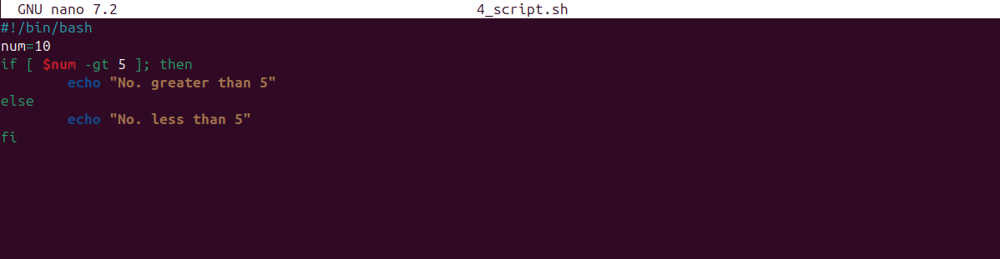
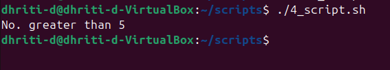
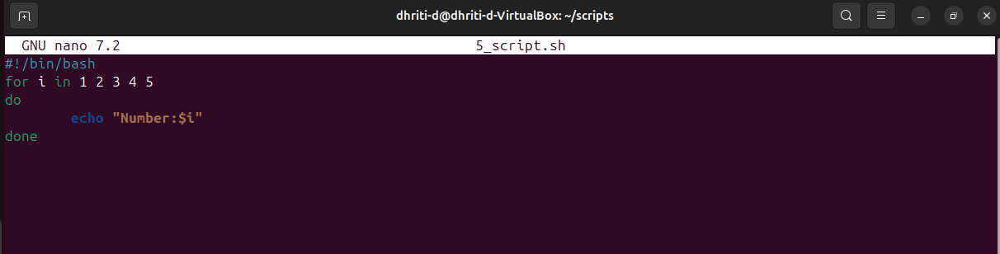
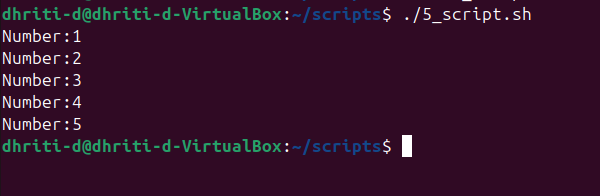

# Assignment 2: Script Execution and Explanation
The scripts chosen are:

**1. 4_script.sh**

**```PURPOSE:```** To check whether the assigned value to a variable "num" is
greater than 5 or not using conditional statements (if-else).



**```EXPLANATION:```**

🔸This script cointains a program having ```conditional statements (if-else)```. 

🔸I have taken a variable "num" and have assigned value 10 to it.

🔸This program will check whether "num" (value assigned to it is 10) is
greater than 5 or not.

🔸If the condition is true, it will print "No. greater than 5".

🔸Else it will print "No. less than 5". 

After running the program, the output was:

**```OUTPUT:```**



**2. 5_script.sh**

**```PURPOSE:```** To print numbers ranging from 1 to 5 using for loop.



**```EXPLANATION:```**

🔸This script contains a program in which ```for loop``` has been used.

🔸The loop declares a variable "i" and sets it to iterate through a range of numbers 1-5.

🔸During each iteration it will print "Number:" followed by the current value of "i".

For example: After first iteration the output will be: Number:1  

After running the program, the output was:

**```OUTPUT:```**



**Extra Questions**

Q1. What is the purpose of #!/bin/bash at the top of a script?

Ans. The purpose of #!/bin/bash at the top of the script is:

1. To specify the interpreter that should be used to execute the script.
2. It ensures that the script is executed by the intended shell (Bash) even if the user's default
interactive shell is different.
3. It also allows the script to be executed directly as a command (if it has execute permissions).

Q2. How do you make a script executable?

Ans. To make a script executable:

1. Add a shebang or hash-bang line i.e. #!/bin/bash, at the very beginning of the script.
2. Use chmod command to add execute permissions to the script file.
3. Once the execute permisssions are set, run the script from the terminal.