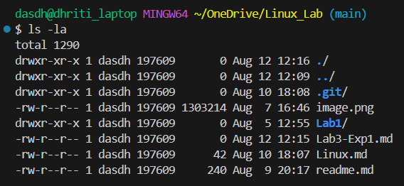

# Basic Linux Commands

'''bash
> pwd
'''

Output Example:

>/c/Users/dasdh/OneDrive/Linux_Lab

## ls flags
### ls commands

The ls command in linux allows to view all the files and folders in current working directory.Flag -a list down all file and folder including the one which are hidden

Output: 

>image.png  Lab1/  Lab3-Exp1.md  Linux.md  readme.md

### 1. ls -a command
Output Example:
>./  ../  .git/  image.png  Lab1/  Lab3-Exp1.md  Linux.md  readme.md

### 2. ls -la command
#### Image Snap Shot:

