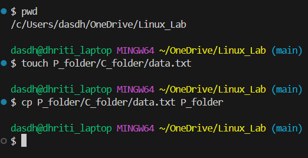

This experiment consists of snapshots in which we have created a parent folder.
In the parent folder we created a child folder.
In the parent folder we created a text file data.txt which we copied it to the child folder.
These are the commands for performing the above experiment.

