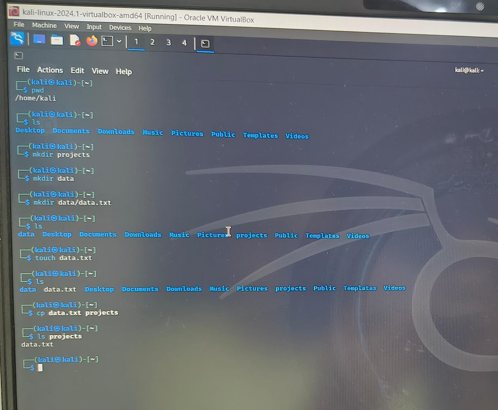

# Linux_Lab

This repository contains hands-on labs and experiments related to Linux and system-level programming. It serves as a learning and testing ground for understanding fundamental and advanced Linux concepts.

# Experiment 2

